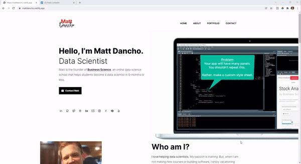

<!-- README.md is generated from README.Rmd. Please edit that file -->

```{r, include = FALSE}
knitr::opts_chunk$set(
  collapse = TRUE,
  comment = "#>",
  fig.path = "man/figures/README-",
  out.width = "100%"
)
```

# portfoliodown

<!-- badges: start -->
<!-- badges: end -->

The goal of portfoliodown is to make is painless to create a polished personal website for data scientists so they can host their project portfolios (and get interviews).

## Installation

You can install the development version of `portfoliodown` from [GitHub](https://github.com/) with:

``` r
# install.packages("devtools")
devtools::install_github("business-science/portfoliodown")
```

## Example Data Science Portfolio

I've hosted an example portfolio at [https://mattdancho.netlify.app/](https://mattdancho.netlify.app/). This portfolio website is automatically generated with `portfoliodown::new_portfolio_site()`, and can then be customized as a `blogdown` website.

```{r, echo=F}

```


