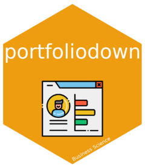

<!-- README.md is generated from README.Rmd. Please edit that file -->

```{r, include = FALSE}
knitr::opts_chunk$set(
  collapse = TRUE,
  comment = "#>",
  fig.path = "man/figures",
  out.width = "100%"
)
```

# portfoliodown <a href="https://business-science.github.io/portfoliodown/"></a>

<!-- badges: start -->
<!-- badges: end -->

The goal of `portfoliodown` is to make it _painless for data scientists_ to create a polished professional website so they can host their project portfolios __(and get great job interviews)__.


## Example: Data Science Portfolio

__Check out an example data science portfolio__ at [https://mattdancho.netlify.app/](https://mattdancho.netlify.app/). It took 15-minutes to make this with `portfoliodown`. 


```{r, echo=F}
knitr::include_graphics("vignettes/example_portfolio.gif")
```

<hr>

## Installation

You can install the development version of `portfoliodown` from [GitHub](https://github.com/) with:

``` r
# install.packages("devtools")
devtools::install_github("business-science/portfoliodown")
```

## Getting Started

- The portfolio website is automatically generated with `portfoliodown::new_portfolio_site()`, and can then be customized as a `blogdown` website.

- To learn more, visit [Getting Started with Portfoliodown](https://business-science.github.io/portfoliodown/articles/getting-started-portfoliodown.html)

## Acknowledgements

The `portfoliodown` package would not be possible without the awesome work of the [raditian-free-hugo-theme](https://github.com/radity/raditian-free-hugo-theme). This is one of the best hugo portfolio templates around.

