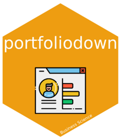
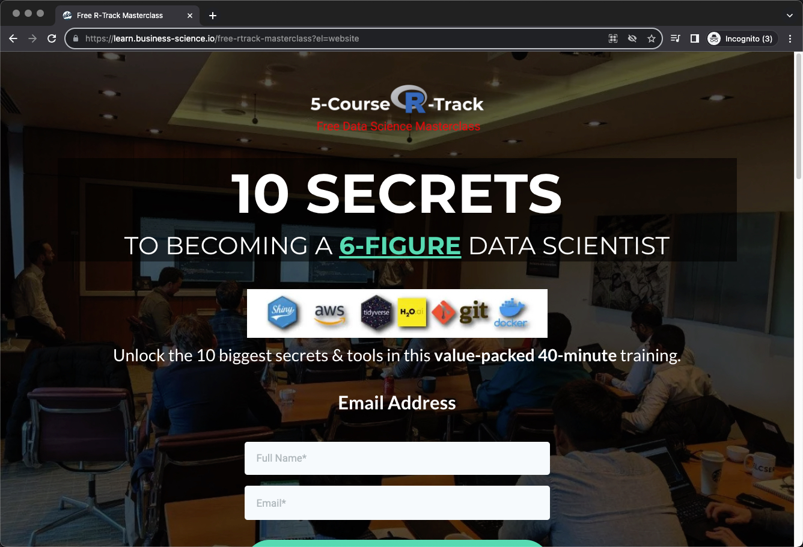

<!-- README.md is generated from README.Rmd. Please edit that file -->

# portfoliodown <a href="https://business-science.github.io/portfoliodown/"></a>

<!-- badges: start -->

[](https://github.com/business-science/portfoliodown/actions)
<!-- badges: end -->

The goal of `portfoliodown` is to make it *painless for data scientists*
to create a polished professional website so they can host their project
portfolios **(and get great job interviews)**.

## Example: Data Science Portfolio

**Check out an example data science portfolio** at
<https://mattdancho.netlify.app/>. It took 15-minutes to make this with
`portfoliodown`.

<figure>

<figcaption aria-hidden="true">Example Portfolio - Raditian
Theme</figcaption>
</figure>

<hr>

## Portfoliodown Theme Demos:

- [Raditian Theme](https://mattdancho.netlify.app/) (Default)

- [Kross Theme](https://mattdancho-kross.netlify.app/)

## Installation

You can install the development version of `portfoliodown` from
[GitHub](https://github.com/) with:

``` r
# install.packages("devtools")
devtools::install_github("business-science/portfoliodown")
```

## Getting Started

- The portfolio website is automatically generated with
  `portfoliodown::new_portfolio_site()`, and can then be customized as a
  `blogdown` website.

- To learn more, visit [Getting Started with
  Portfoliodown](https://business-science.github.io/portfoliodown/articles/getting-started-portfoliodown.html)

## Acknowledgements

The `portfoliodown` package would not be possible without the awesome
work of:

- The [Blogdown Team](https://github.com/rstudio/blogdown) and its team
  at RStudio

- The
  [raditian-free-hugo-theme](https://github.com/radity/raditian-free-hugo-theme).
  This is one of the best hugo portfolio templates around.

- The [kross-hugo-theme](https://github.com/themefisher/kross-hugo).
  Another great portfolio template.

# Do you need help becoming a Data Scientist with R right now?

I put together a [free R
masterclass](https://learn.business-science.io/free-rtrack-masterclass?el=documentation)
where I share the 10 skills that helped me become a better data
scientist.

<figure>

<figcaption aria-hidden="true">R-Track Masterclass</figcaption>
</figure>

<a href="https://learn.business-science.io/free-rtrack-masterclass?el=documentation">
<p style="text-align:center; font-size:20px;">
Watch the free R masterclass
</p>

</a>
