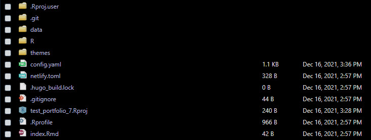
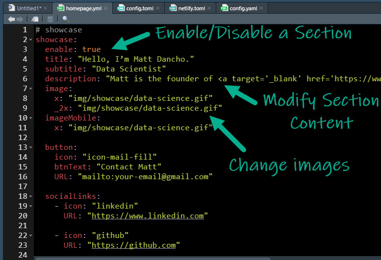
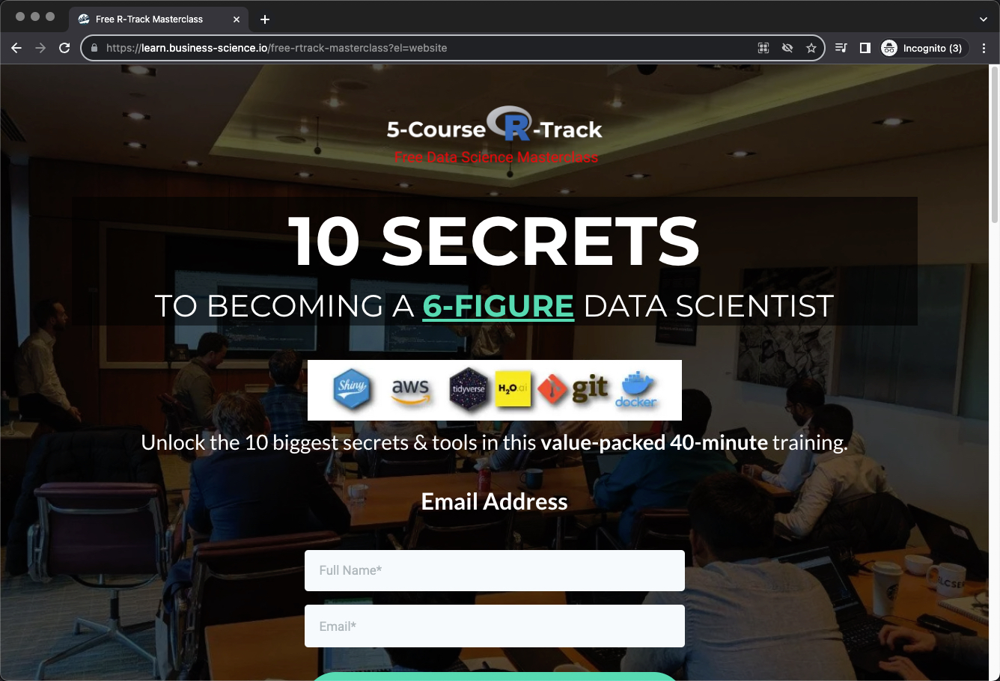

```{r, include = FALSE}
knitr::opts_chunk$set(
    message = FALSE,
    warning = FALSE,
    fig.width = 8, 
    fig.height = 4.5,
    fig.align = 'center',
    out.width='95%', 
    dpi = 100
)
```


The goal of `portfoliodown` is to make it _painless for data scientists_ to create polished data science project portfolios, and ultimately help them __land high-quality interviews and great careers.__ 

## Example Data Science Portfolio

You can quickly view an example data science portfolio that I've set up here:  [https://mattdancho.netlify.app/](https://mattdancho.netlify.app/). This is the default portfolio that comes with `portfoliodown`.


## Getting Started

First, load `portfoliodown`. 

```{r setup}
library(portfoliodown)
```


Next, run the `new_portfolio_site()` function, which will install a directory of files that are used to create the __Data Science Portfolio Template.__

```{r, echo=F}

```

Next, serve the site using `serve_site()` to view what the website will look like once deployed. You can run `stop_server()` or restart the R session to stop serving. The website will be served at `localhost:4321` or a similar URL. 


## Customizing the Website

Under the hood, the `portfoliodown` website is simply a `blogdown` website without a blog. Therefore, the site can be updated just like a Blogdown site. A great reference is [Blogdown: Creating Websites with R Markdown](https://bookdown.org/yihui/blogdown/).

We'll cover a few key aspects of customization. 

### config.yaml

The `config.yaml` identifies the overall aspects of the website including:

1. __Params:__ Google Tag Manager, Logo, Sections (section order can be adjusted here)

2. __Menu:__ Modifies the navbar tabs and order. 

### homepage.yml

Navigate in the directory to `data > homepage.yml`, where the main sections of the website can be updated. 

```{r, echo=F}

```

- `enable`: In general, you can toggle visibility of a section by setting to `true/false`

- Content: You can modify all of the section content. The layout will stay the same, but the text, images and buttons can be modified.

## Deployment

Deployment is recommended in two steps:

1. __Push your website to Github:__ Use `use_github()` to push the repository from your local machine to the remote GitHub site. 

2. __Connect Netlify to GitHub & Publish:__ [Netlify has options for free hosting of websites.](https://www.netlify.com/) Simply create an account. Then connect Netlify to GitHub. Select the GitHub repo containing your website. Then deploy. 


# Do you need help becoming a Data Scientist with R right now?

I put together a [free R masterclass](https://learn.business-science.io/free-rtrack-masterclass?el=documentation) where I share the 10 skills that helped me become a better data scientist. 

```{r, echo=F}

```


<a href="https://learn.business-science.io/free-rtrack-masterclass?el=documentation"><p style="text-align:center; font-size:20px;">Watch the free R masterclass</p></a>
